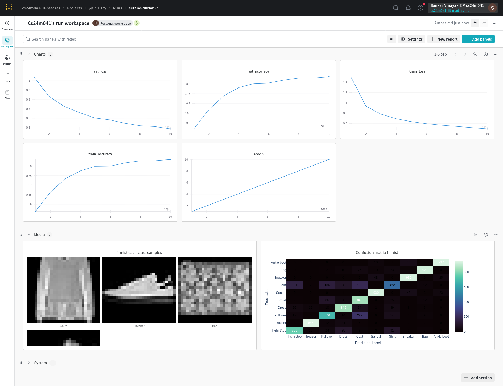

# DL-assignment 1
This repository is created for the Assignment 1 of DA6401 Introduction to Deep Learning cousrse(Mitesh M. Khapra Indian Institure of technology Madras) by Sankar Vinayak E P

This repository contains code as well as experiments done on the fasion mnist dataset

This is an implimentation of neural network framework taking inspiration(not copied) from existing framework like Pytorch and Tensorfolow primarily using numpy

It make use of [Weights and bias](https://wandb.ai) framework for experiment tracking. To test out the code given in this either you can make use of the jupyter notebook or use the python file given

### Instructions on running the code
Clone the repository
```
git clone https://github.com/sankarvinayak/DL-assignment1.git
```
or Download the [zipfile][https://github.com/sankarvinayak/DL-assignment1/archive/refs/heads/main.zip] and extract in to current directry
```
cd DL-assignment1
python train.py --wandb_entity myname --wandb_project myprojectname
```
example
```
python train.py -wp "cli_try" -we "cs24m041-iit-madras" -b 32 -e 10 -o "nadam" -lr 0.0001 -w_d 0.0005 -w_i "random" -sz 64 -nhl 3 -a "ReLU"
```
The above code will log the following data in the wandb

For more information follow the `DL_assignment_1.ipynb` file in which each step is described more clearly 

for detailed documentation chechout the [docs](./docs/Getting%20_started.md)
### Arguments supported
| Name | Default Value | Description |
| :---: | :-------------: | :----------- |
| `-wp`, `--wandb_project` | 6401_Assignment1 | Project name used to track experiments in Weights & Biases dashboard |
| `-we`, `--wandb_entity` | cs24m041  | Wandb Entity used to track experiments in the Weights & Biases dashboard. |
| `-d`, `--dataset` | fashion_mnist | choices:  ["mnist", "fashion_mnist"] |
| `-e`, `--epochs` | 14 |  Number of epochs to train neural network.|
| `-b`, `--batch_size` | 64 | Batch size used to train neural network. | 
| `-l`, `--loss` | cross_entropy | choices:  ["mean_squared_error", "cross_entropy"] |
| `-o`, `--optimizer` | adam | choices:  ["sgd", "momentum", "nag", "rmsprop", "adam", "nadam"] | 
| `-lr`, `--learning_rate` | 0.001 | Learning rate used to optimize model parameters | 
| `-m`, `--momentum` | 0.9 | Momentum used by momentum and nag optimizers. |
| `-beta`, `--beta` | 0.9 | Beta used by rmsprop optimizer | 
| `-beta1`, `--beta1` | 0.9 | Beta1 used by adam and nadam optimizers. | 
| `-beta2`, `--beta2` | 0.999 | Beta2 used by adam and nadam optimizers. |
| `-eps`, `--epsilon` | 0.000001 | Epsilon used by optimizers. |
| `-w_d`, `--weight_decay` | .0 | Weight decay used by optimizers. |
| `-w_i`, `--weight_init` | Xavier | choices:  ["random", "Xavier"] | 
| `-nhl`, `--num_layers` | 4 | Number of hidden layers used in feedforward neural network. | 
| `-sz`, `--hidden_size` | 128 | Number of hidden neurons in a feedforward layer. |
| `-a`, `--activation` | ReLU | choices:  ["identity", "sigmoid", "tanh", "ReLU"] |
<br>
Note: Even after entering the entity name you may be prompted to create or login with wandb at that point select existing account(2) and enter your private key to continue
You can run the full set of sweep by running the `run_wandb_sweep(entity,project)` inside the `wandb_function.py` file

##### Without loggind into wandb

You can directly use the function provided `train_model` with all the necessary arguments will return a trained model


